# Bereitstellung: Abläufe

Die Bereitstellungsmodi und alle Ansible-Playbooks unter `Ansible/` als Ablaufdiagramm: vom Formular über den Deploy-Worker bis zum einzelnen Playbook-Schritt. Übergaben und Rückkanäle der ganzen Kette stehen in der [Bereitstellungskette](deploy-chain.md), Voraussetzungen und Supportgrenzen in [DEPLOYMENT.md](../DEPLOYMENT.md).

Die Diagramme beschreiben den ausgelieferten Code. Wer Reihenfolge, Verzweigung oder Meldung eines Modus, des Workers oder eines Playbooks ändert, zieht das zugehörige Diagramm im selben Commit nach. Beschlossene, noch nicht gelieferte Änderungen stehen in den Plänen unter `docs/audits/`, nicht hier.

## Modi auf einen Blick

| Modus | Playbooks in dieser Reihenfolge | Staffelung | Liest | MAC-Ergebnis nötig | Braucht Datacenter/Datastore |
|---|---|---|---|---|---|
| `full` (Vollständige Kette) | Create je VM, dann `powercycleVMs`, `exportVMs`, `startVMs`; `autostartVMs` nur bei Mission mit Autostart | ja | Power-Cycle- und Start-Wartezeit | ja | ja |
| `create` (VMs anlegen) | Create je VM | nein | nichts | nein | ja |
| `powercycle` (Ein- und ausschalten mit MAC-Export) | `powercycleVMs`, dann `exportVMs` | ja | Power-Cycle-Wartezeit | ja | ja |
| `export` (MAC-Adressen exportieren) | `exportVMs` | nein | nichts | ja | ja |
| `start` (VMs starten) | `startVMs` | ja | Start-Wartezeit | nein | ja |
| `autostart` (ESXi-Autostart anwenden) | `autostartVMs` | nein | nichts | nein | nein |
| `inventory` (Inventar abrufen) | `inventoryESXi` | nein | nichts | nein | nein |

Die Namen in Klammern sind die deutschen Portalbezeichnungen; `DeployFlowsDocContractTest` leitet Modi, Bezeichnungen und Playbook-Reihenfolge aus dem Code ab. `inventory` ist der Systemmodus des Inventarabrufs: ohne Mission, nie über das Formular. Er entsteht durch den Zeitplan, durch **Alle aktualisieren** und den Einzelabruf im Systemstatus, beim Speichern und Testen eines ESXi-Zugangs und nach einem `create`- oder `full`-Auftrag, der `succeeded` oder `partial` endet. Quelle der Reihenfolge ist `ansible_playbooks_for_mode()`; Staffelung, Wartezeitsperren im Formular, MAC-Erwartung und Create-Zeilen werden daraus abgeleitet. `create_identity_check_tasks.yml` und `powercycle_vm_tasks.yml` sind eingebundene Task-Dateien. `requirements.yml` ist die Versionssperre der Collections und hat keinen Ablauf.

## Einreihen

Das Formular sammelt Mission, ESXi- und Ansible-Zugang, Modus, VM-Auswahl, Wartezeiten, Startzeitpunkt, Staffelung und die ausführliche Ausgabe. Die Sperren darunter prüft die Seite vor dem Absenden und das Repository im Einreihen erneut.

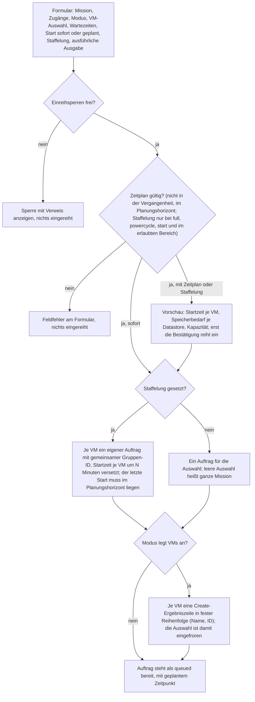

Einreihsperren, jeweils mit Verweis auf die Stelle, die sie behebt:

- Voraussetzungen: Mission vorhanden, ESXi- und Ansible-Zugang vorhanden und gewählt, API-Basis-URL auflösbar.
- Mission: gewählt, keine Vorlage, mindestens eine VM, kein anderer aktiver Auftrag.
- Ort: Datastore gesetzt und Datacenter auflösbar, außer für `autostart`.
- Identität: Das Inventar des gewählten Hosts kennt eine namensgleiche VM, die nicht an die Portal-VM gebunden ist.
- Auswahl: nicht leer, gehört zur Mission, bleibt unter der Obergrenze je Auftrag.
- Netz: allgemeine Zuordnung und PXE-Karte laut Netzvertrag; welche Modi sperren und welche nur warnen, steht in [DEPLOYMENT.md](../DEPLOYMENT.md#deploy-modes-and-the-mac-generation-power-cycle).
- Create-Historie: Eine frühere Create-Einheit derselben VM ist noch ungeklärt (`uncertain`).

## Worker: ein Auftrag

Der Deploy-Worker bearbeitet immer genau einen Auftrag. Ein Abbruch greift an jeder Schrittgrenze: Der laufende Schritt endet auf ESXi vollständig, danach startet kein weiterer.

Vor jeder SSH-/SFTP-Anmeldung prüft der gemeinsame [Hostidentitäts-Guard](trust-flows.md#ssh-und-sftp-zum-ubuntu-host) den Pin gegen den aktuellen Zugang. Fehlende Bestätigung bei neuen Zugängen, Schlüsselabweichung, nicht dauerhaft speicherbare Prüfung oder interne Wiederanmeldung auf demselben Objekt brechen vor Passwort-/Dateiübertragung ab. Die Fehlerwege dieses Workers bleiben maßgeblich für VM- und Auftragszustände; der Host-Preflight läuft vor der Markierung `deploying`: Scheitert der Auftrag davor, bleiben alle VM-Zustände unverändert.

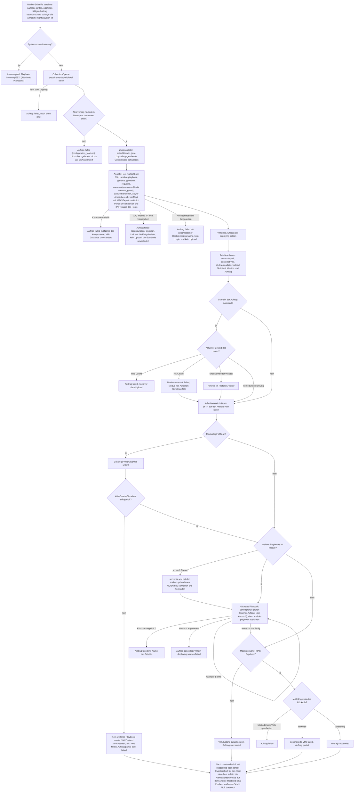

## Create je VM

`create` und `full` legen VMs einzeln an: je VM ein Prepare, ein Launch als Async-Job und eine Statusabfrage alle `VIRTUSPHERE_CREATE_POLL_INTERVAL_SECONDS` Sekunden. Jede Einheit hat ein dauerhaftes Ergebnis, bevor die nächste beginnt.

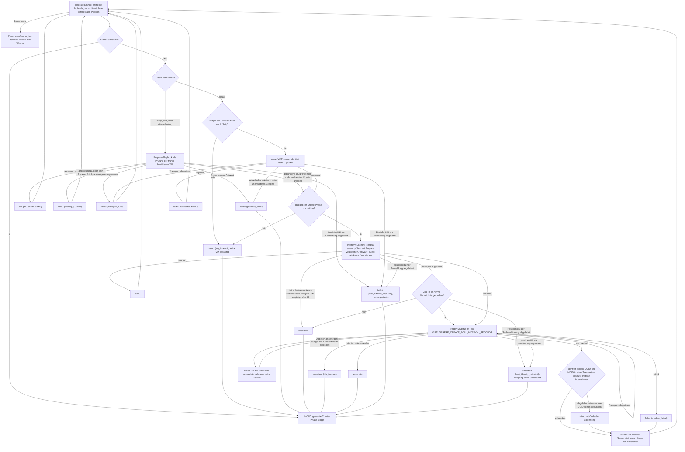

Die Prüfung vor einer übersprungenen VM (`verify_skip`) nutzt dasselbe Prepare-Playbook, schreibt aber in eine eigene Ergebnisdatei. Ein gewöhnlicher Fehlschlag betrifft nur seine VM; die nächste Einheit beginnt trotzdem. `uncertain`, `protocol_error`, `ownership_lost`, `job_timeout` und `host_identity_rejected` stoppen die ganze Create-Phase. Eine Hostablehnung vor Prepare, Launch oder `verify_skip` ergibt `failed`: Die gesperrte Verbindung hat nichts ausgeführt. Bei einer bereits gestarteten Einheit oder der Job-ID-Suche nach einem tatsächlich verlorenen Launch bleibt der Ausgang auf ESXi unbekannt; die Hostablehnung ergibt sofort `uncertain`, ohne weitere Statusversuche. Eine `uncertain`-Einheit wird nie aufgeräumt: Ihre Statusdatei ist der einzige Nachweis. Den Vertrauenscheck vor Anmeldung beschreibt [Verbindungen und Vertrauensanker](trust-flows.md#ssh-und-sftp-zum-ubuntu-host).

## Playbooks

Jedes Playbook läuft auf dem Ansible-Host gegen genau einen ESXi-Host, liest `accounts.yml` und meist `serverlist.yml` und setzt den Vertrauensanker über `SSL_CERT_FILE`.

### createVMPrepare

Liest nur. Beantwortet für genau eine Portal-VM, ob auf dem Host schon eine VM mit ihrem Namen existiert und ob sie der Portal-VM gehört.

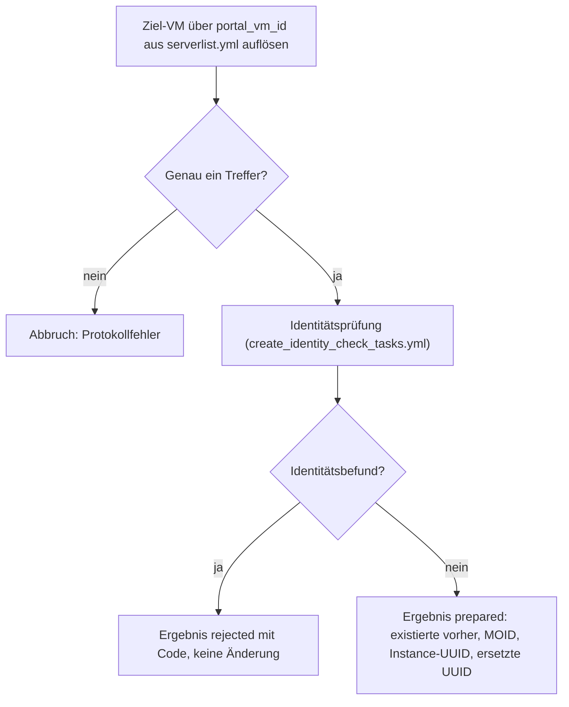

### create_identity_check_tasks

Die eine Identitätsmatrix für Prepare, Launch und Status. Ein Befund bricht nie ab, sondern setzt einen geschlossenen Code. Scheitert dagegen das Lesen des Live-Inventars selbst (Anmeldung, Transport, Modul), endet der Lauf ohne Ergebniszeile; der Worker wertet das als unlesbare Antwort.

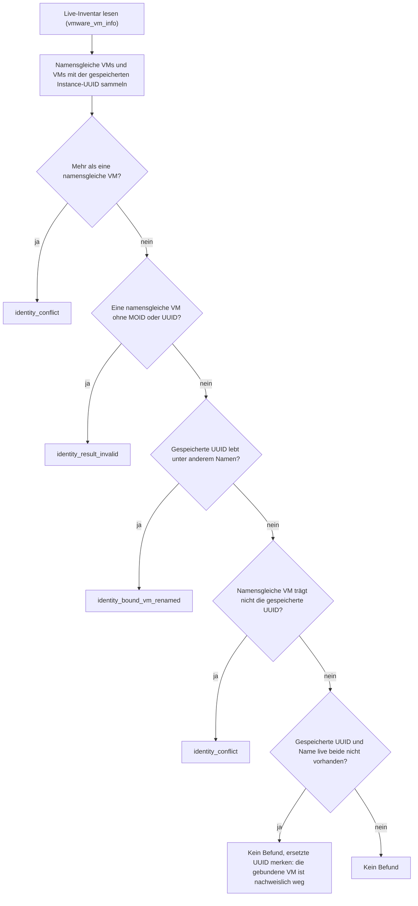

Nach einem erfolgreichen Async-Job ruft das Status-Playbook die Matrix ohne Abgleich gegen die gespeicherte UUID auf (`vs_identity_require_stored_match` aus), weil die VM gerade erst entstanden ist. Dann entfallen die Fragen E und F.

### createVMLaunch

Mutiert genau eine VM. Alles, was sich seit Prepare geändert hat, führt vor dem Modulaufruf zur Ablehnung.

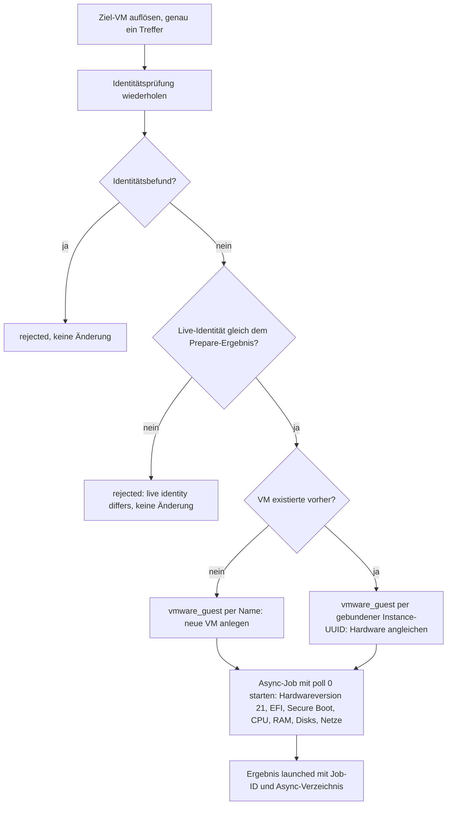

### createVMStatus

Fragt eine gespeicherte Job-ID genau einmal ab; der Worker wiederholt die Abfrage.

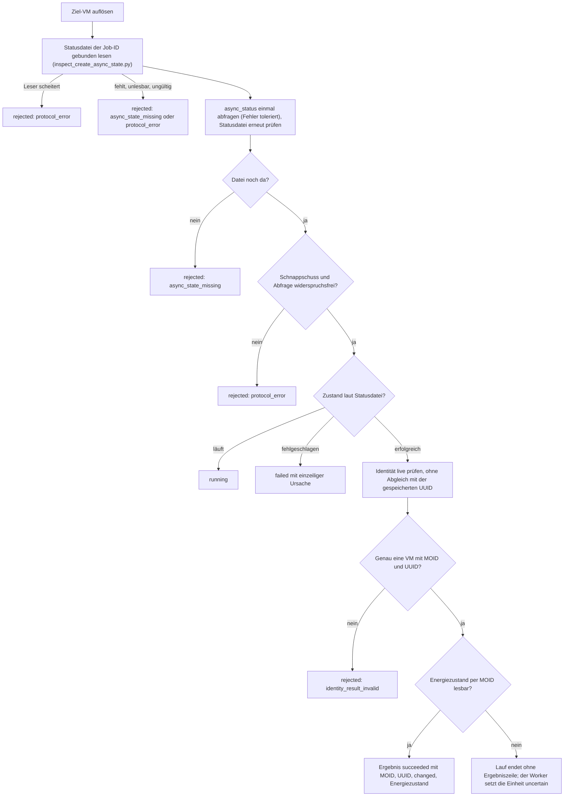

Den Zustand bestimmt die Statusdatei, die `inspect_create_async_state.py` gebunden liest; `async_status` muss ihr nur widerspruchsfrei zustimmen.

### createVMCleanup

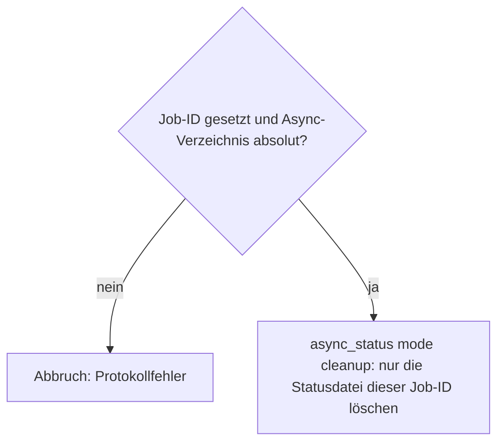

Der Worker ruft es erst, wenn das Ergebnis der Einheit gespeichert ist, und nie für eine `uncertain`-Einheit.

### powercycleVMs und powercycle_vm_tasks

Erzeugt MAC-Adressen: ESXi vergibt einer Netzwerkkarte ihre MAC erst beim ersten Einschalten.

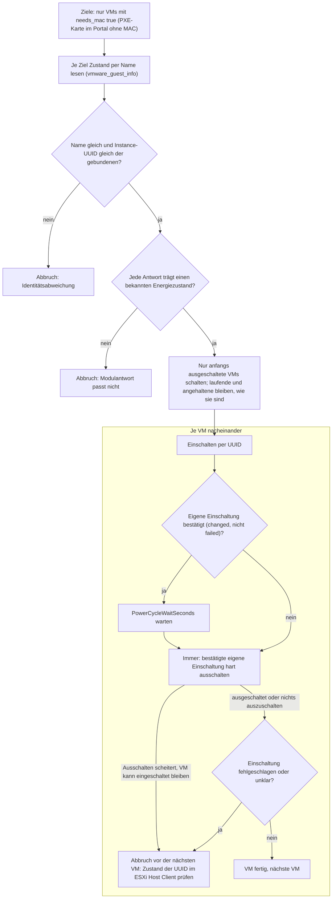

Je VM meldet das Playbook `[n/total] RUN`, `pass` oder `fail Powercycle <VM>`. Ein harter Prozessabbruch (SSH-Abriss, Kill) führt den Ausschaltblock nicht mehr aus und kann eine eingeschaltete VM zurücklassen.

### exportVMs-Informations

Liest die MACs und schickt sie an das Portal. Ein Fehler betrifft nur die einzelne VM.

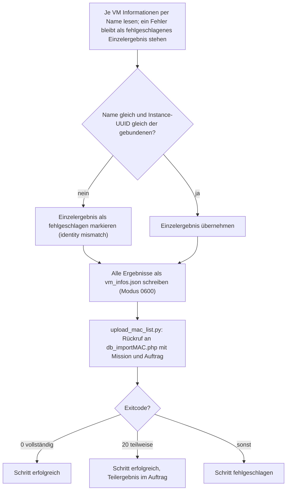

### startVMs

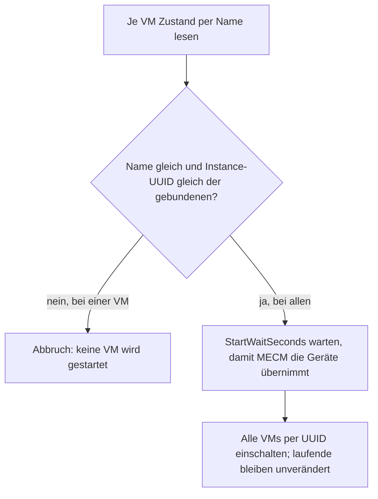

### autostartVMs

Schreibt die Autostart-Richtlinie des Hosts für die VMs einer Mission.

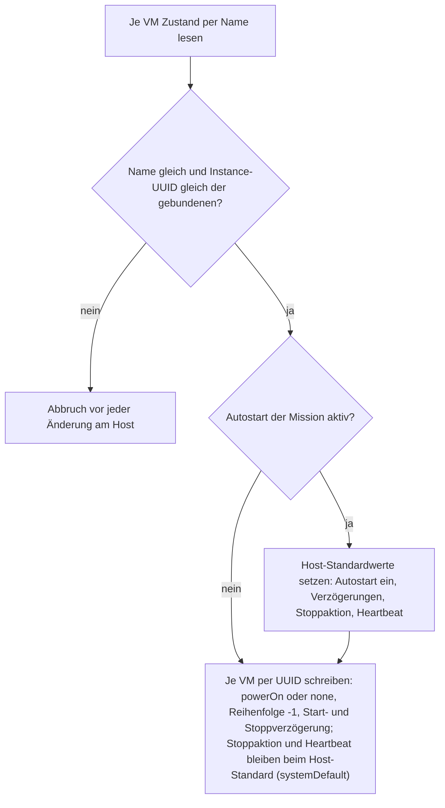

Der Host-Autostart wird nie ausgeschaltet, weil ein Host VMs mehrerer Missionen tragen kann; eine Mission zieht ihre Richtlinie zurück, indem jede ihrer VMs `none` erhält.

### inventoryESXi

Liest nur und läuft ohne Mission als Systemauftrag je ESXi-Zugang.

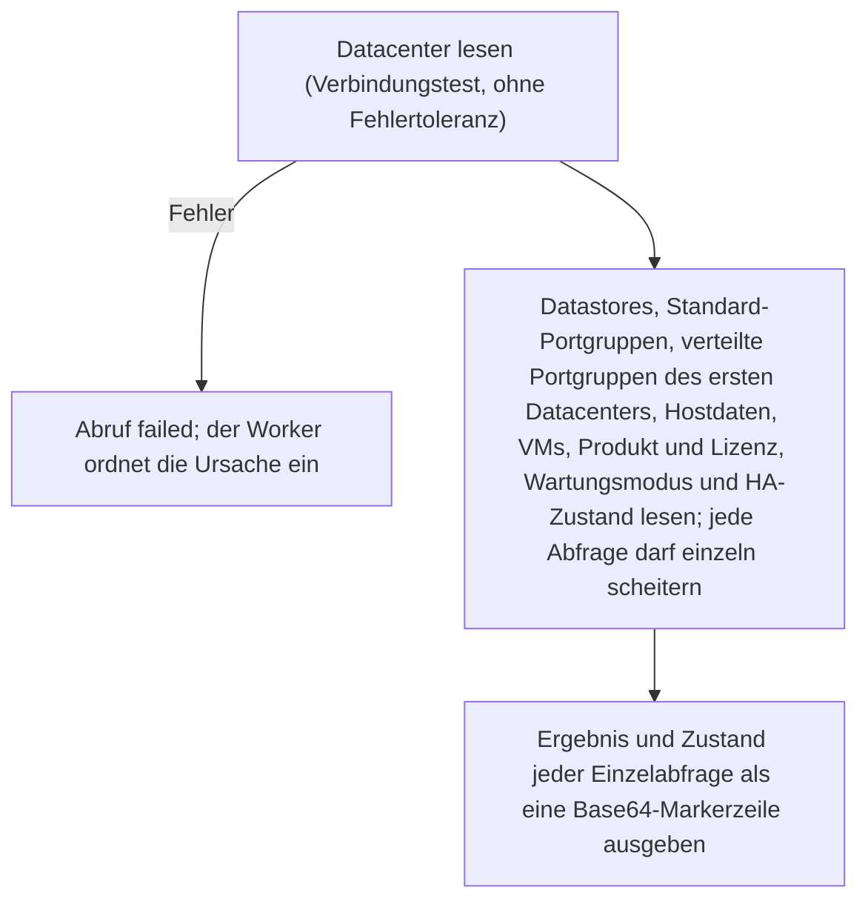

Im Worker folgt darauf: Ausgabe begrenzt einlesen, Markerzeile auswerten, Inventar-Cache und Host-Eigenschaften speichern, VLAN-Katalog abgleichen. Ein Fehlschlag erhöht die Fehlerserie des Zugangs; der vorige Cache bleibt erhalten.
