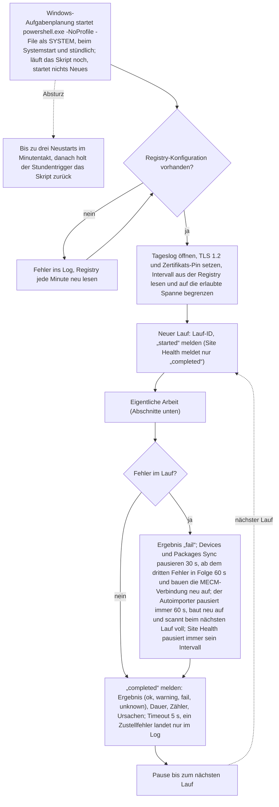
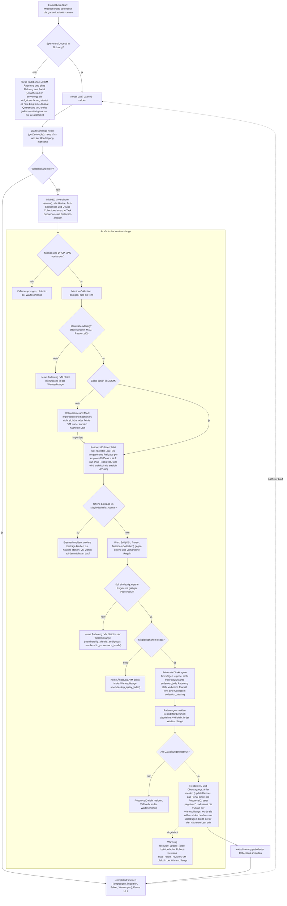
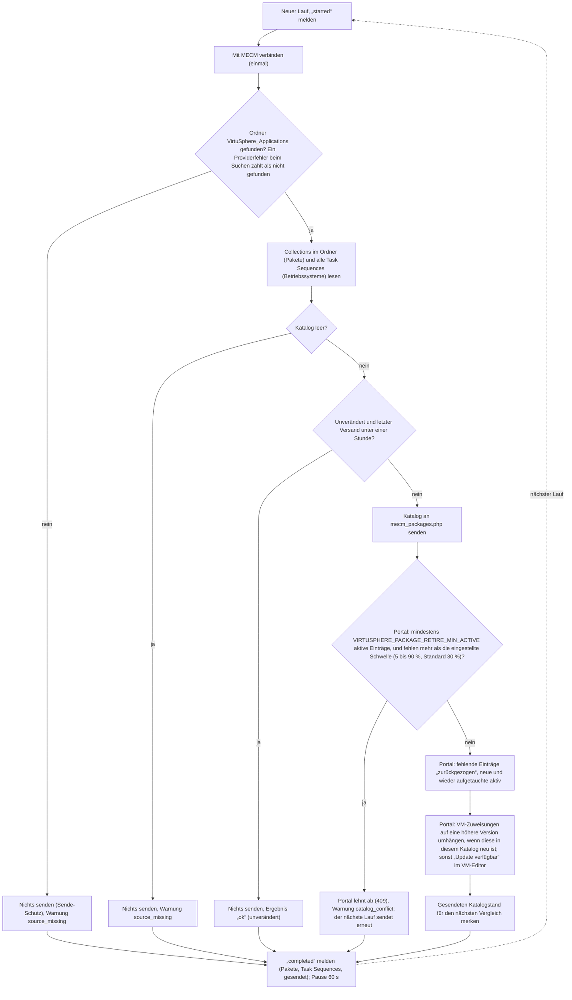
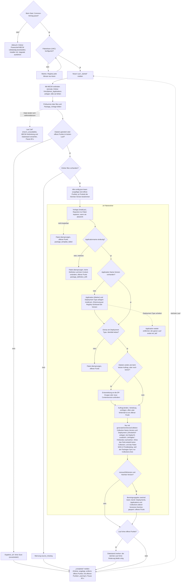
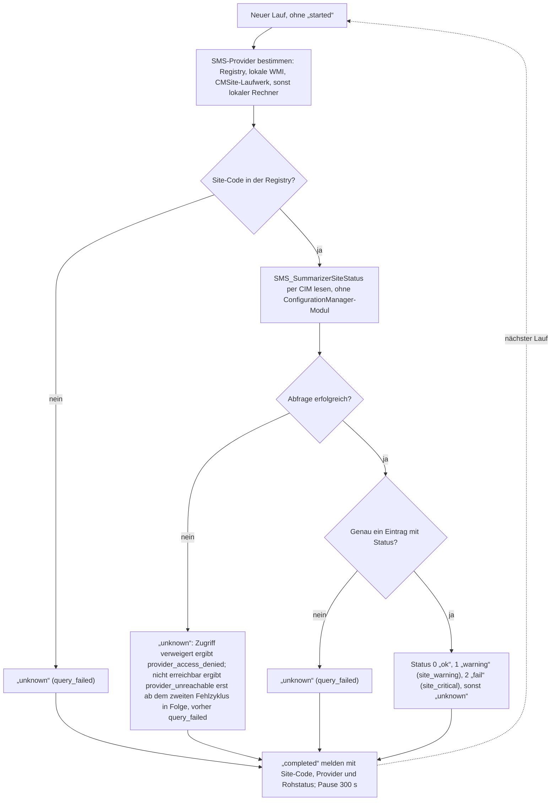

# MECM-Serveraufgaben: Abläufe

Die vier geplanten Aufgaben, die `Powershell-MECM/install-VirtuSphere-MECM.ps1` auf dem MECM-Server einrichtet, als Ablaufdiagramm. Installation, Registry-Werte, Überwachung und Fehlersuche stehen in der [MECM-Integration](mecm-integration.md); dieses Dokument zeigt nur, was die Skripte in welcher Reihenfolge tun.

Die Diagramme beschreiben den ausgelieferten Code. Wer den Ablauf eines der vier Skripte ändert (Reihenfolge, Verzweigung, Meldung), zieht das zugehörige Diagramm im selben Commit nach. Beschlossene, noch nicht gelieferte Änderungen stehen in den Plänen unter `docs/audits/`, nicht hier.

| Aufgabe | Skript | Takt (Standard, Spanne) | Registry-Wert | Tageslog |
|---|---|---|---|---|
| VirtuSphere MECM Devices Sync | `mecm_new-device-sync.ps1` | 10 s, 5 bis 3600 | `DeviceSyncIntervalSeconds` | `JJJJ-MM-TT_device-sync.log` |
| VirtuSphere MECM Packages Sync | `mecm_Packages-TaskSeq-sync.ps1` | 60 s, 10 bis 3600 | `PackagesSyncIntervalSeconds` | `JJJJ-MM-TT_packages-sync.log` |
| VirtuSphere MECM Package Import | `mecm_autoimporter.ps1` | 60 s, 30 bis 3600 | `ImporterIntervalSeconds` | `JJJJ-MM-TT_autoimporter.log` |
| VirtuSphere MECM Site Health | `mecm_site-health.ps1` | 300 s, 60 bis 3600 | `SiteHealthIntervalSeconds` | `JJJJ-MM-TT_site-health.log` |

Die Tageslogs liegen unter dem Registry-Wert `LogRoot` (Standard `C:\Program Files\VirtuSphere\Logs`) und bleiben 30 Tage. Jede Aufgabe meldet ihren Lauf an `mecm_report.php?action=reportRun`; das Portal zeigt ihn unter Systemstatus.

## Gemeinsamer Rahmen

Alle vier Skripte sind Endlosschleifen mit demselben Rahmen. Die Abschnitte darunter zeigen jeweils nur die eigentliche Arbeit eines Laufs.

## Devices Sync

Trägt VMs aus der Warteschlange des Portals in MECM ein und setzt ihre Mitgliedschaften in OS-, Paket- und Missions-Collections. In der Warteschlange stehen neue VMs vor dem Rollout und VMs, deren Zuweisungen jemand an MECM übertragen hat. Jede Mitgliedschaftsänderung steht vorher im Journal, damit ein Absturz nichts Unklares hinterlässt.

## Packages Sync

Meldet dem Portal den MECM-Katalog: Jede Device Collection im Ordner `VirtuSphere_Applications` ist ein Paket, jede Task Sequence ein Betriebssystem. Gesendet wird nur bei Änderung oder spätestens stündlich. Das Portal zieht fehlende Einträge zurück, löscht sie aber nicht; der Wartungsdienst entfernt zurückgezogene Pakete erst nach `VIRTUSPHERE_PACKAGE_PURGE_AFTER_DAYS` Tagen und nur, wenn keine VM sie mehr nutzt und ihre Zuweisungen nie umgehängt wurden; ein Paket, dessen Zuweisungen einmal auf eine höhere Version umgehängt wurden, bleibt dauerhaft stehen.

## Package Import (Autoimporter)

Macht aus den Paketordnern unter `files` mit ihrer `config.json` MECM-Applications samt Deployment Type und Verteilung, mit `generateOwnDeviceColletion` auch Collection und Deployments. Gescannt wird nur, wenn sich Dateien unter `files` oder `Package_Vorlage` geändert haben oder der letzte Lauf offene Punkte hatte.

## Site Health

Fragt den Status der konfigurierten MECM-Site ab und meldet ihn als Ampel. Gemeldet werden nur Site-Code, Provider und der Rohstatus, nie der Text der MECM-Statusmeldung.

