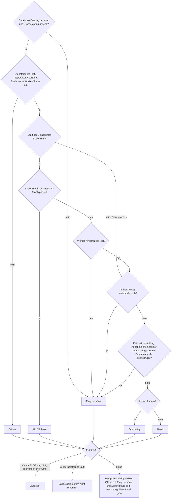
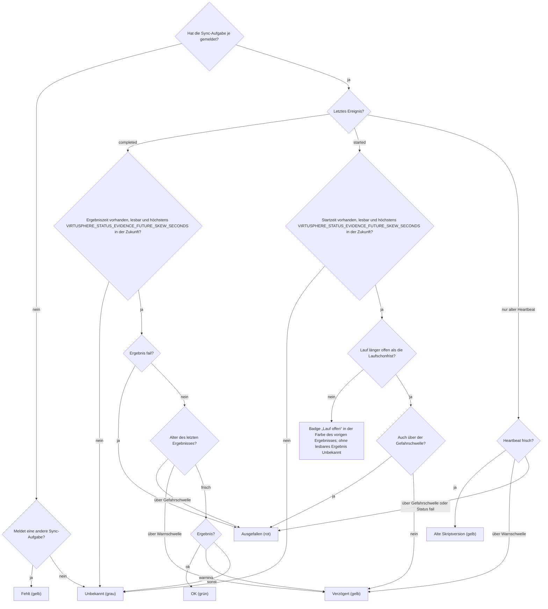
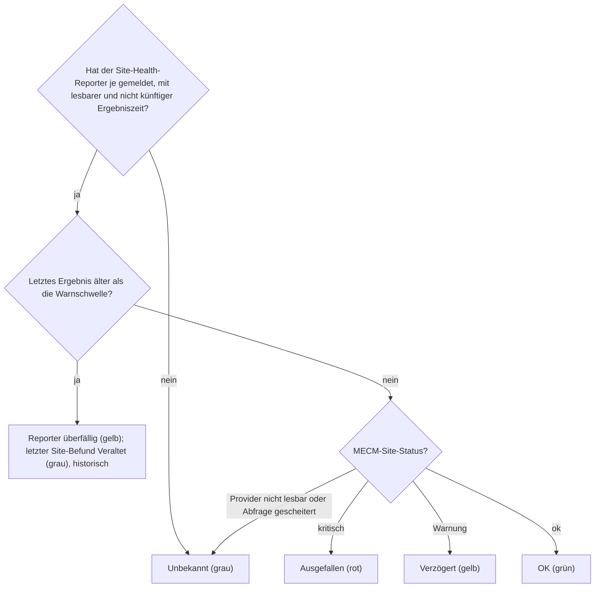
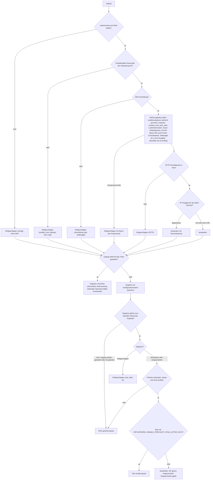
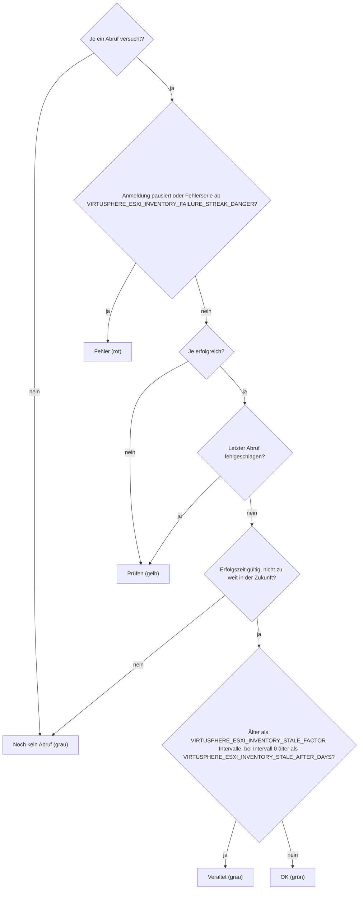
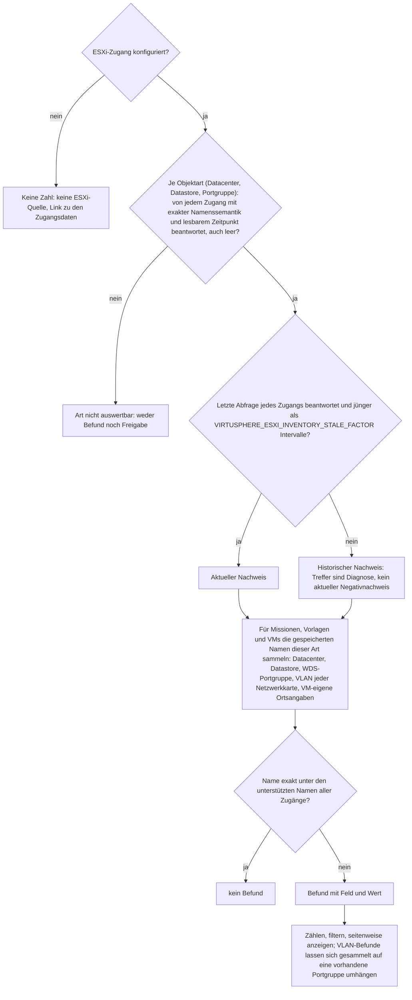
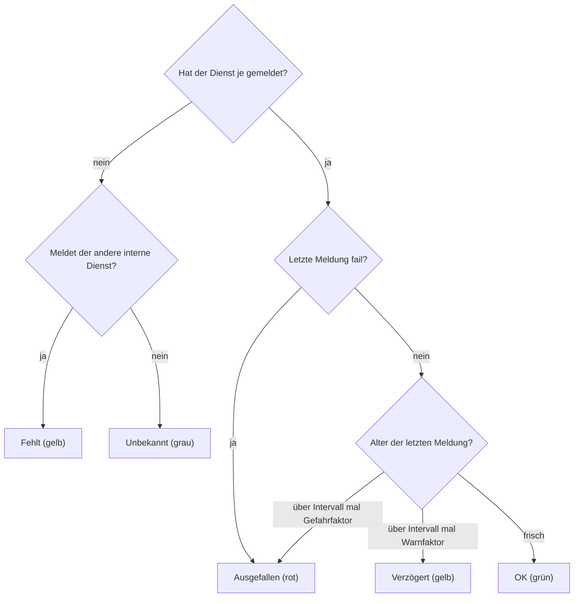
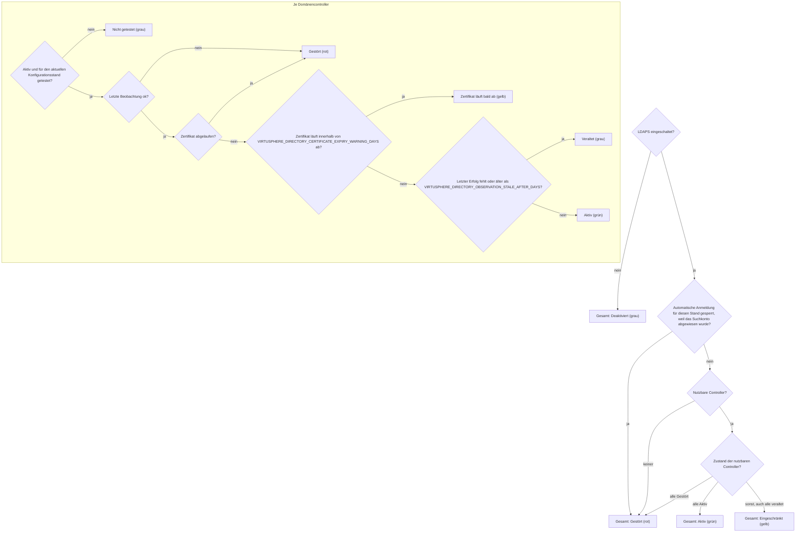

# Systemstatus: Prüfungen

Wie die Seite **Systemstatus** zu jeder Ampel kommt: Datenquelle, Reihenfolge der Regeln und Ergebnis. Was bei einer roten oder gelben Ampel zu tun ist, steht in der Portalhilfe des Systemstatus und in der [Störungsdiagnose](troubleshooting.md); die MECM-Seite der Daten beschreiben die [MECM-Integration](mecm-integration.md) und die [MECM-Serveraufgaben](mecm-scheduled-tasks.md).

Die Diagramme beschreiben den ausgelieferten Code. Wer eine Ampelregel, eine Quelle oder einen Schwellwert ändert, zieht das zugehörige Diagramm im selben Commit nach. Beschlossene, noch nicht gelieferte Änderungen stehen in den Plänen unter `docs/audits/`, nicht hier. Schwellwerte werden hier nur mit ihrem Konstantennamen genannt; der Wert steht im Code.

| Bereich | Quelle | Ampel je Zeile | Kachel in der Übersicht |
|---|---|---|---|
| Bereitstellungsdienst | Laufzeitidentität, Supervisor, Worker-Status, Warteschlange, Prüffälle | Verfügbarkeit plus Aufmerksamkeit | Summe der Karte |
| MECM | Laufberichte der drei Sync-Aufgaben und des Site-Health-Reporters | je Aufgabe | schlechteste Zeile |
| Ansible-Test | Volltest je Ansible-Zugang, manuell oder geplant | je Zugang | schlechteste Zeile |
| ESXi-Inventar | Inventarabruf je ESXi-Zugang | je Zugang | schlechteste Zeile |
| Abweichungen | Missionen und VMs gegen den Inventar-Cache | Anzahl Befunde | Anzahl |
| Interne Dienste | Wartungsdienst und Deploy-Worker | je Dienst | schlechteste Zeile |
| Active Directory | LDAPS-Konfiguration und Domänencontroller | je Controller | Gesamtzustand |

Die Bereiche heißen hier wie die Kacheln der Übersicht auf der Seite; `SystemStatusChecksDocContractTest` leitet die Namen aus den Kachelbeschriftungen ab.

Die Rangfolge für „schlechteste Zeile“ ist für alle Bereiche dieselbe (`virtusphere_heartbeat_state_rank()`): rot vor „fehlt“ vor gelb vor „alte Skriptversion“ vor grau vor grün.

## Bereitstellungsdienst

Die Schonfrist für einen nicht beanspruchten Auftrag ist `VIRTUSPHERE_DEPLOY_CLAIM_GRACE_SECONDS`. Ist die Annahme pausiert, sagt die Karte das ausdrücklich, statt einen Rückstand zu melden.

## MECM

Die drei Sync-Aufgaben (Devices Sync, Packages Sync, Package Import) und der Site-Health-Reporter melden jeden Lauf an `mecm_report.php?action=reportRun`. Sync und Site werden getrennt bewertet: Ein kritischer Site-Zustand beweist keinen ausgefallenen Datenfluss, und ein ausgefallener Sync behauptet nicht, MECM selbst sei kritisch.

Der Site-Health-Reporter wird eigens bewertet: Ein überfälliger Bericht färbt den Reporter gelb. Der letzte Site-Befund bleibt getrennt sichtbar, grau als „Veraltet“ und historisch markiert. Sein Alter behauptet keinen aktuellen kritischen MECM-Zustand. Dashboard und Systemstatus lesen beide Achsen aus demselben Snapshot.

Schwellen: Die Warnschwelle liegt bei `VIRTUSPHERE_HEARTBEAT_WARN_MULTIPLIER` Intervallen, mindestens `VIRTUSPHERE_HEARTBEAT_WARN_FLOOR_SECONDS`; die Gefahrschwelle bei `VIRTUSPHERE_HEARTBEAT_DANGER_MULTIPLIER` Intervallen, mindestens `VIRTUSPHERE_HEARTBEAT_DANGER_FLOOR_SECONDS`; die Laufschonfrist eines offenen Laufs ist der größte Wert aus Warnschwelle und `VIRTUSPHERE_RUN_GRACE_SECONDS`. Erst nach ihr wird ein offener Lauf bewertet, und die Gefahrschwelle entscheidet zwischen Verzögert und Ausgefallen. Liegt die Gefahrschwelle unter der Laufschonfrist, wie bei kurzen Takten, springt ein hängender Lauf nach der Schonfrist sofort auf Rot. Über den Zeilen stehen zwei Hinweise, die keine Ampel färben: abgewiesene Maschinenzugriffe des letzten Tages mit IP, und frische Meldungen von mehr als einer IP-Adresse.

## Ansible-Test

Nachweis ist der Volltest je Ansible-Zugang. Er läuft über **Jetzt vollständig testen**, über **Zugangsdaten, Testen** oder geplant als Kindprozess des Deploy-Workers. Der letzte tatsächlich bearbeitete Missionsauftrag steht daneben, färbt die Ampel aber nicht.

Die getrennte Hostidentitätsanzeige zeigt Pin, Bestätigung und zuletzt beobachtete Abweichung. Sie ist kein Volltest und färbt dessen vorhandenen Nachweis nicht um. Jede SSH-/SFTP-Anmeldung geht über den [gemeinsamen Vertrauensablauf](trust-flows.md#ssh-und-sftp-zum-ubuntu-host); das gilt auch für die SFTP-Probe nach bestandenem SSH-Preflight.

## ESXi-Inventar

Nachweis ist der Inventarabruf je ESXi-Zugang, ein Systemauftrag des Deploy-Workers. Er läuft im eingestellten Intervall, manuell über **Alle aktualisieren** oder den Einzelabruf, beim Speichern und Testen eines ESXi-Zugangs und nach jedem Endzustand eines `create`- oder `full`-Auftrags, sobald eine Create-Einheit ihre Ansible-Job-ID dauerhaft gespeichert hat. Der Abruf ist fail-soft und wird durch den vorhandenen Systemauftrag-Writer dedupliziert.

Host-Eigenschaften aus einem erfolgreichen Abruf färben die Ampel nicht, sondern erscheinen als eigene Badges: freie Lizenz, HA-Cluster, Wartungsmodus. Über den Karten nennt eine Zeile, warum kein automatischer Abruf läuft: Intervall 0, kein Ansible-Zugang für den Abruf, Deploy-Worker nicht aktiv oder Anmeldung pausiert.

## Abweichungen

Verglichen wird exakt, auch in der Groß- und Kleinschreibung. Ist keine Art auswertbar, zeigt der Bereich keine Zahl, sondern einen Hinweis mit Link zum ESXi-Inventar. Mit Inventarintervall 0 entfällt die Altersgrenze. Die Inventarwarnungen der Deploy-Seite und die Abweichungs-Badge der Missionsliste folgen einer älteren Regel: Sie lesen den Inventar-Cache ohne Namenssemantik und Altersgrenze und überspringen nur leere Arten. Sie können deshalb anders urteilen als dieser Bereich.

## Interne Dienste

Wartungsdienst und Deploy-Worker schreiben ihren Status direkt in dieselbe Tabelle wie die MECM-Aufgaben, im Takt `VIRTUSPHERE_MAINTENANCE_HEARTBEAT_INTERVAL_SECONDS` beziehungsweise `VIRTUSPHERE_DEPLOY_WORKER_HEARTBEAT_INTERVAL_SECONDS`.

## Active Directory

Erscheint nur, wenn eine LDAPS-Konfiguration gespeichert ist, und nur für Benutzer mit dem Recht **Benutzerkonten verwalten** (`users.manage`): Die Controller-Namen sind interne Infrastruktur.

Nutzbar ist ein Controller, der aktiv ist und für den aktuellen Konfigurationsstand getestet wurde. Jede echte Anmeldung, jede Sitzungsprüfung und jeder Test schreibt eine Beobachtung; automatische Fehlschläge nehmen die Zulassung nicht zurück, nur ein fehlgeschlagener manueller Test tut das.

Das Zertifikat kennt die Seite nur aus dem letzten manuellen Test. Ein unlesbares Ablaufdatum überspringt die beiden Zertifikatsfragen.
