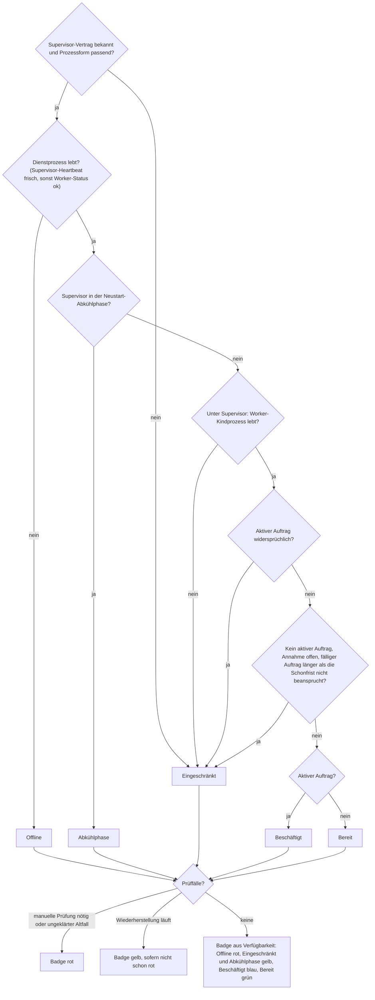
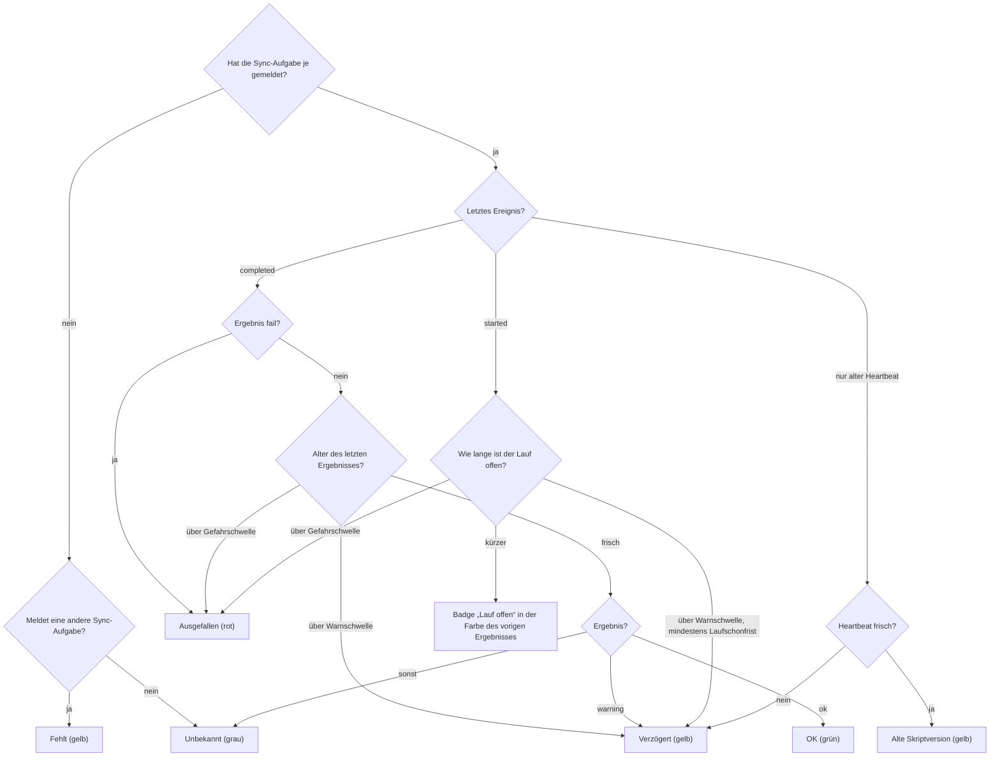
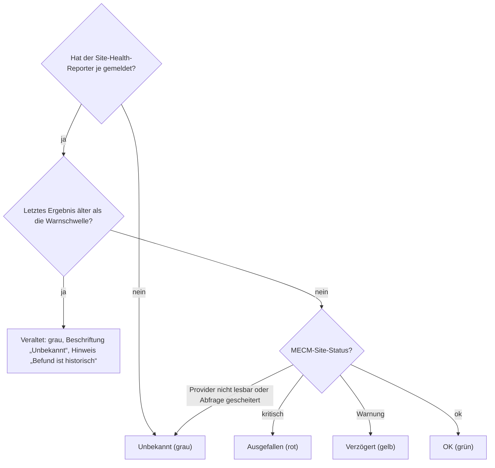
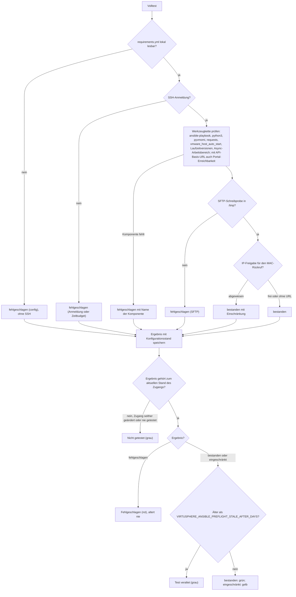
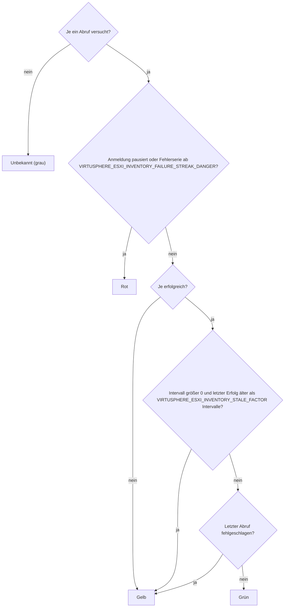
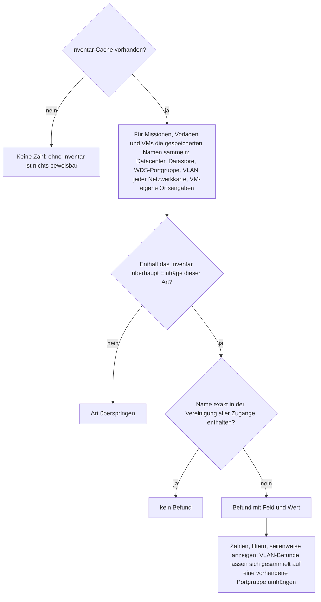
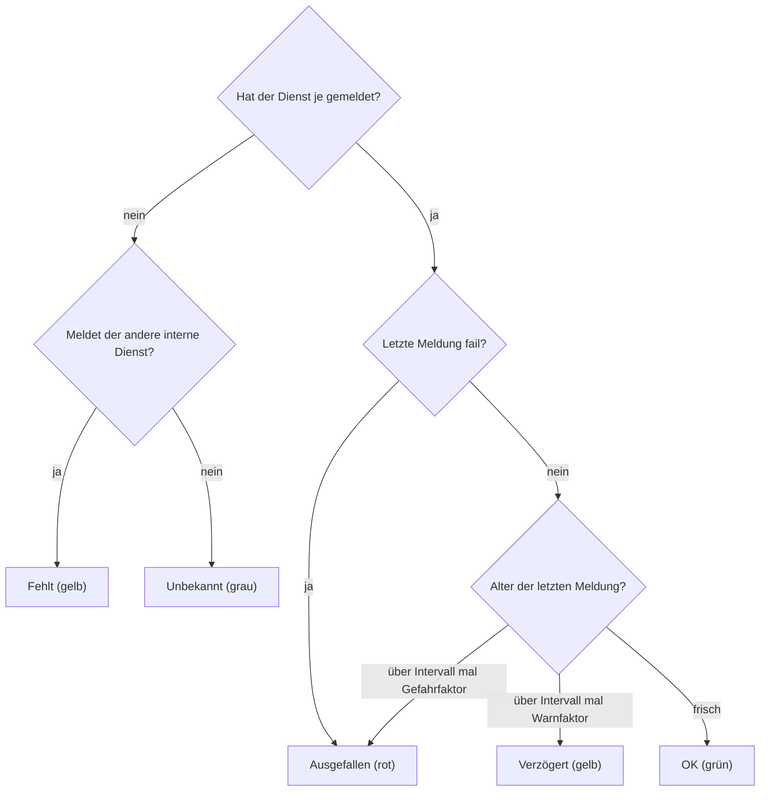
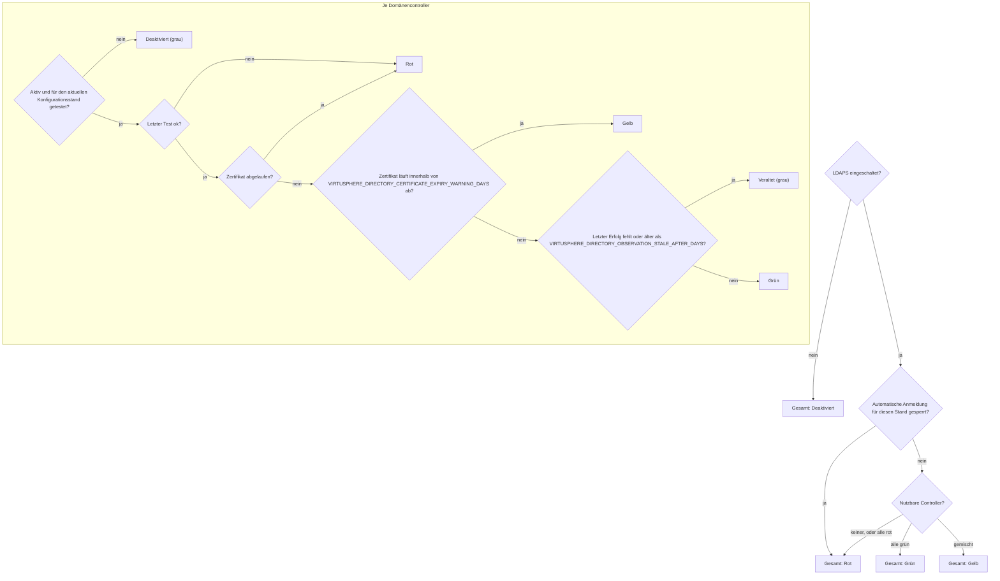

# Systemstatus: Prüfungen

Wie die Seite **Systemstatus** zu jeder Ampel kommt: Datenquelle, Reihenfolge der Regeln und Ergebnis. Was bei einer roten oder gelben Ampel zu tun ist, steht in der Portalhilfe des Systemstatus und in der [Störungsdiagnose](troubleshooting.md); die MECM-Seite der Daten beschreibt die [MECM-Integration](mecm-integration.md).

Die Diagramme beschreiben den ausgelieferten Code. Wer eine Ampelregel, eine Quelle oder einen Schwellwert ändert, zieht das zugehörige Diagramm im selben Commit nach. Beschlossene, noch nicht gelieferte Änderungen stehen in den Plänen unter `docs/audits/`, nicht hier. Schwellwerte werden hier nur mit ihrem Konstantennamen genannt; der Wert steht im Code.

| Bereich | Quelle | Ampel je Zeile | Kachel in der Übersicht |
|---|---|---|---|
| Deploy-Dienst | Laufzeitidentität, Supervisor, Worker-Status, Warteschlange, Prüffälle | Verfügbarkeit plus Aufmerksamkeit | Summe der Karte |
| MECM | Laufberichte der drei Sync-Aufgaben und des Site-Health-Reporters | je Aufgabe | schlechteste Zeile |
| Ansible | Volltest je Ansible-Zugang, manuell oder geplant | je Zugang | schlechteste Zeile |
| ESXi | Inventarabruf je ESXi-Zugang | je Zugang | schlechteste Zeile |
| Abweichungen | Missionen und VMs gegen den Inventar-Cache | Anzahl Befunde | Anzahl |
| Intern | Wartungsdienst und Deploy-Worker | je Dienst | schlechteste Zeile |
| Verzeichnis | LDAPS-Konfiguration und Domänencontroller | je Controller | Gesamtzustand |

Die Rangfolge für „schlechteste Zeile“ ist für alle Bereiche dieselbe (`virtusphere_heartbeat_state_rank()`): rot vor „fehlt“ vor gelb vor „alte Skriptversion“ vor grau vor grün.

## Deploy-Dienst

Die Schonfrist für einen nicht beanspruchten Auftrag ist `VIRTUSPHERE_DEPLOY_CLAIM_GRACE_SECONDS`. Ist die Annahme pausiert, sagt die Karte das ausdrücklich, statt einen Rückstand zu melden.

## MECM

Die drei Sync-Aufgaben (Devices Sync, Packages Sync, Package Import) und der Site-Health-Reporter melden jeden Lauf an `mecm_report.php?action=reportRun`. Sync und Site werden getrennt bewertet: Ein kritischer Site-Zustand beweist keinen ausgefallenen Datenfluss, und ein ausgefallener Sync behauptet nicht, MECM selbst sei kritisch.

Der Site-Health-Reporter wird eigens bewertet: Sein Alter färbt die Zeile nie gelb oder rot, weil ein fehlender Nachweis kein kritischer MECM-Zustand ist.

Schwellen: Die Warnschwelle liegt bei `VIRTUSPHERE_HEARTBEAT_WARN_MULTIPLIER` (aktuell 3) Intervallen, mindestens `VIRTUSPHERE_HEARTBEAT_WARN_FLOOR_SECONDS`; die Gefahrschwelle bei `VIRTUSPHERE_HEARTBEAT_DANGER_MULTIPLIER` (aktuell 10) Intervallen, mindestens `VIRTUSPHERE_HEARTBEAT_DANGER_FLOOR_SECONDS`; ein offener Lauf gilt frühestens nach `VIRTUSPHERE_RUN_GRACE_SECONDS` als verzögert. Über den Zeilen stehen zwei Hinweise, die keine Ampel färben: abgewiesene Maschinenzugriffe des letzten Tages mit IP, und frische Meldungen von mehr als einer IP-Adresse.

## Ansible

Nachweis ist der Volltest je Ansible-Zugang. Er läuft über **Jetzt vollständig testen**, über **Zugangsdaten, Testen** oder geplant als Kindprozess des Deploy-Workers. Der letzte tatsächlich bearbeitete Missionsauftrag steht daneben, färbt die Ampel aber nicht.

## ESXi

Nachweis ist der Inventarabruf je ESXi-Zugang, ein Systemauftrag des Deploy-Workers. Er läuft im eingestellten Intervall, manuell über **Alle aktualisieren** und nach jedem `create`- oder `full`-Auftrag.

Host-Eigenschaften aus einem erfolgreichen Abruf färben die Ampel nicht, sondern erscheinen als eigene Badges: freie Lizenz, HA-Cluster, Wartungsmodus. Über den Karten nennt eine Zeile, warum kein automatischer Abruf läuft: Intervall 0, kein Ansible-Zugang für den Abruf, Deploy-Worker nicht aktiv oder Anmeldung pausiert.

## Abweichungen

Verglichen wird exakt, auch in der Groß- und Kleinschreibung. Die Deploy-Seite zeigt dieselben Befunde je Zugang zusätzlich als Warnung.

## Intern

Wartungsdienst und Deploy-Worker schreiben ihren Status direkt in dieselbe Tabelle wie die MECM-Aufgaben, im Takt `VIRTUSPHERE_MAINTENANCE_HEARTBEAT_INTERVAL_SECONDS` beziehungsweise `VIRTUSPHERE_DEPLOY_WORKER_HEARTBEAT_INTERVAL_SECONDS`.

## Verzeichnis

Erscheint nur, wenn die LDAPS-Anmeldung eingerichtet ist.

