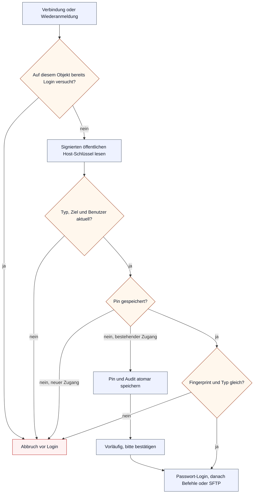

# Verbindungen und Vertrauensanker

Der [Ablauf-Einstieg](flows.md) verlinkt die übrigen Abläufe und erklärt die gemeinsame Legende. Dieser Abschnitt beschreibt ausschließlich die Hostidentität zwischen PHP/Worker und dem Ubuntu-Ansible-Host. ESXi-Zertifikatsvertrauen bleibt im [ESXi-Inventar](esxi-inventory.md), die übrigen Übergaben in der [Bereitstellungskette](deploy-chain.md).

## SSH und SFTP zum Ubuntu-Host

Zweck: Ein Passwort oder eine Datei mit ESXi-Zugangsdaten darf erst nach Prüfung des SSH-Host-Schlüssels an den Ubuntu-Host gehen.



| Zugang | Zulässige Verbindung | Bestätigung |
|---|---|---|
| Neu, ohne Pin | Nur Handshake zur Anzeige von Fingerprint und Typ; kein Login | Admin vergleicht unabhängig auf dem Host und bestätigt ausdrücklich |
| Typ, Host oder Port geändert | Pin, Beobachtung, Bestätigung und Upgrade-Ausnahme zurückgesetzt; kein Login | Das neue Ziel unabhängig prüfen und ausdrücklich bestätigen |
| Bestehend nach Upgrade, noch ohne Pin | Erste Beobachtung wird vor Login atomar samt Audit angeheftet | Bis zur Bestätigung steht „vorläufig angeheftet, bitte bestätigen“ |
| Vorläufig oder bestätigt, gleicher Schlüssel | Login erlaubt | Bestätigung eines unveränderten Pins entwertet den bisherigen Volltest nicht |
| Vorläufig oder bestätigt, anderer Schlüssel | Vor Login gesperrt; Beobachtung sichtbar, Pin bleibt erhalten | Einen legitimen Wechsel unabhängig prüfen und ausdrücklich bestätigen |
| Wiederanmeldung auf demselben Verbindungsobjekt | Vor Login gesperrt, weil phpseclib die Signaturprüfung auf diesem Objekt zwischenspeichert | Jeder externe Verbindungsaufbau verwendet ein frisches Guard-Objekt; kein automatischer Wiederholungsversuch |

### Wenn etwas schiefgeht

Ein fehlender/unprüfbarer Schlüssel, ein veralteter Zugangssnapshot oder eine fehlgeschlagene dauerhafte Speicherung führt vor der Passwortübertragung zum Abbruch. Bei einem abweichenden Schlüssel bleibt der gespeicherte Pin stehen; die beobachtete Abweichung erscheint in Zugangsdaten und Systemstatus. Der Auftrag protokolliert die geschlossene Hostidentitätsursache. Zwei erste Verbindungen werden am selben Zugangsdatensatz serialisiert; nur der erste Schlüssel wird angeheftet.

Dieser Vertrauenscheck schreibt selbst keinen VM-, Auftrags- oder MECM-Zustand. Die vorhandenen Worker-Fehlerwege entscheiden den Auftrags- und VM-Endzustand; der [Worker-Ablauf](deploy-flows.md#worker-ein-auftrag) beschreibt die derzeitige Markierung vor dem Host-Preflight. Insbesondere garantiert dieses Paket keine Wiederherstellung eines VM-Vorzustands nach einem Auftragsfehler. Bei einem Zugangstest ändern sich nur das getrennte Testresultat und die Hostbeobachtung.

### Im Code

- `lib/ssh_host_identity.php`: `ssh_host_identity()`, `ssh_verified_login()`, gemeinsame Guard-Trait für SSH und SFTP. Der Guard greift auch bei phpseclibs interner Wiederanmeldung.
- `lib/repo/credential_host_identity.php`: aktueller Typ, Endpunkt und Benutzer; atomare erste Anheftung, unveränderlicher Pin bei Abweichung und ausdrückliche Bestätigung mit alter Revision und altem Pin.
- `lib/migrations/0059_ansible_host_identity.php`: Upgrade-Berechtigung einmalig für bestehende Zugänge; Frischschema und neue Zugänge haben sie nicht.
- `lib/credentials_host_identity.php`: gemeinsame Anzeige und bestätigtes Formular; Portal-POST mit `credentials.manage`, CSRF und der gemeinsamen Bestätigungsmodalität.

### Prüfung

`SshHostKeyTest`, `AnsibleHostIdentityIntegrationTest` und `SshHostIdentityContractTest`: keine Anmeldung bei Abweichung, kein Geheimnistransfer bei fehlender Speicherung, Erst-Anheften und spätere Abweichung, neue Zugänge, Bestätigung, veraltete Formulare und Zugangssnapshots, Wiederanmeldung und Transportabdeckung. Die Laborprobe LP-09 benötigt einen vom Nutzer betriebenen Testhost; der synthetische QA-Stack enthält keinen SSH-Server.

### Betrieb

In **Zugangsdaten** den Ansible-Zugang testen, Fingerprint und Typ auf dem Ubuntu-Host unabhängig vergleichen und **Geprüften Host-Schlüssel bestätigen** wählen. Beispiel für ED25519:

```sh
ssh-keygen -lf /etc/ssh/ssh_host_ed25519_key.pub -E sha256
```

Die zum angezeigten Schlüsseltyp passende öffentliche Host-Schlüsseldatei verwenden. SSH-Kennwörter oder private Schlüssel werden dafür nicht benötigt. Bei einem legitimen Schlüsselwechsel bleibt der Zugang bis zur ausdrücklichen Bestätigung gesperrt. Ein falscher Schlüssel während der ersten Verbindung nach dem Upgrade kann vorläufig angeheftet werden; nur der unabhängige Vergleich deckt dieses verbleibende Erstkontakt-Risiko auf. Details: [ADR-0045](../adr/ADR-0045-ansible-host-identity.md), Portalhilfe **Zugangsdaten**.
